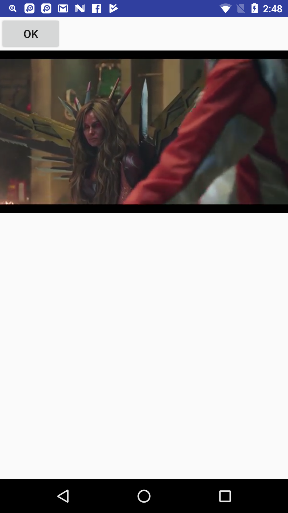
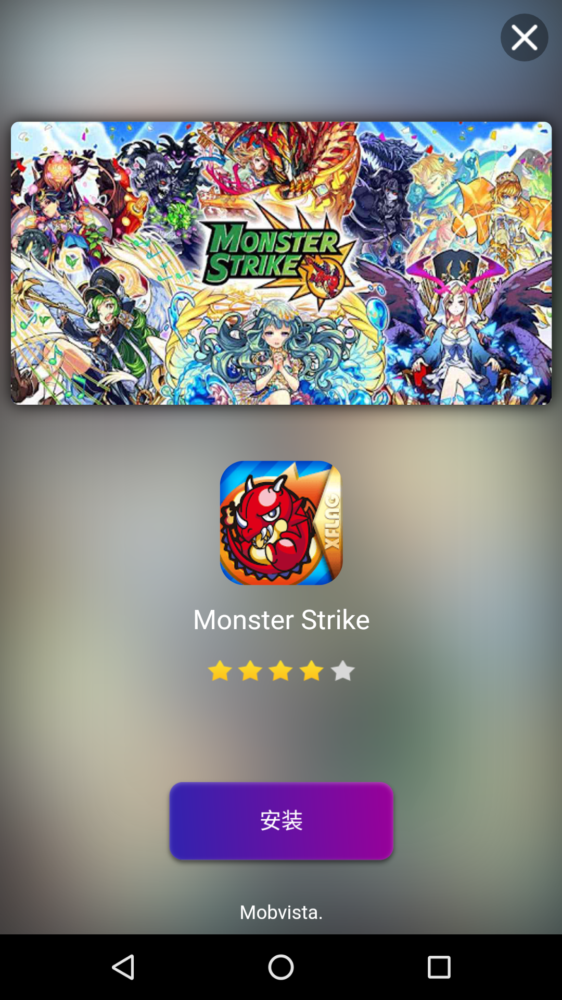
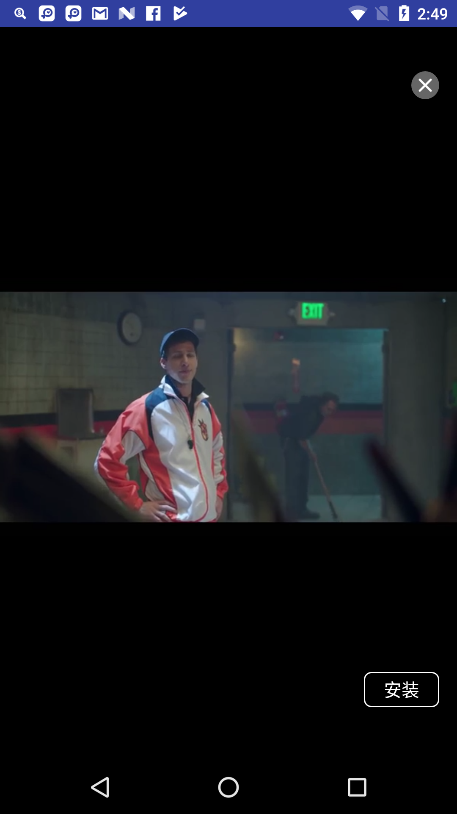

Rewarded Video / Native Ads
--

* Requirement Jar file

	put all aar file to you project libs/
	
	|filename|
	|---|
	|alphab-release.aar|
	|common-release.aar|
	|mvjscommon-release.aar|
	|mvnative-release.aar|
	|nativex-release.aar|
	|playercommon-release.aar|
	|reward-release.aar|
	|videocommon-release.aar|
	|videofeeds-release.aar|
	

Setup SDK
---

* Gradle config

	
	* app build.gradle

	```
	
	...
	
	repositories {
   		flatDir { dirs 'libs' }
	}
	
	...
	
	compile(name: 'alphab-release', ext: 'aar')
	compile(name: 'common-release', ext: 'aar')
	compile(name: 'mvnative-release', ext: 'aar')
	compile(name: 'mvjscommon-release', ext: 'aar')
	compile(name: 'nativex-release', ext: 'aar')
	compile(name: 'playercommon-release', ext: 'aar')
	compile(name: 'reward-release', ext: 'aar')
	compile(name: 'videocommon-release', ext: 'aar')
	compile(name: 'videofeeds-release', ext: 'aar')
	
	...
	
	
	```


* AndroidManifest.xml Configuration

```xml

...

<uses-permission android:name="android.permission.INTERNET" />
<uses-permission android:name="android.permission.WRITE_EXTERNAL_STORAGE"/>
<uses-permission android:name="android.permission.ACCESS_NETWORK_STATE" />

...

<activity
	android:name="com.mobvista.msdk.reward.player.MVRewardVideoActivity"
	android:configChanges="orientation|keyboardHidden|screenSize" 
	android:theme="@android:style/Theme.NoTitleBar.Fullscreen"/>

```

* Init SKD

	Put the initiating codes into Android ***Application***

```java

private final static String APP_ID = "";
private final static String APP_KEY = ""

MobVistaSDK sdk = MobVistaSDKFactory.getMobVistaSDK();
Map<String,String> Map = sdk.getMVConfigurationMap(APP_ID, APP_KEY); 
sdk.init(Map, this);
```

Native-video Ads Integration
---

* MainActivity

```java

...

private MVMediaView mMVMediaView;
private LinearLayout mLinearLayout;
private Context mContext

private final static String NATIVE_UNIT_ID = "xxx";

@Override
protected void onCreate(@Nullable Bundle savedInstanceState) {

    mContext = this;

    Map<String, Object> property = preloadNative(NATIVE_UNIT_ID);
    mMVMediaView = generateMediaView(mContext);
    showNative(mContext, mMVMediaView, property);
}

public Map<String, Object> preloadNative(String unitId) {
    MobVistaSDK sdk = MobVistaSDKFactory.getMobVistaSDK();
    Map<String, Object> preloadMap = new HashMap<String, Object>();
    preloadMap.put(MobVistaConstans.PROPERTIES_LAYOUT_TYPE, MobVistaConstans.LAYOUT_NATIVE);
    preloadMap.put(MobVistaConstans.PROPERTIES_UNIT_ID, unitId);
    preloadMap.put(MobVistaConstans.NATIVE_VIDEO_WIDTH, 720);//the width of video ,defalt 1024
    preloadMap.put(MobVistaConstans.NATIVE_VIDEO_HEIGHT, 480);//the heigh of video ,defalt 720
    preloadMap.put(MobVistaConstans.NATIVE_VIDEO_SUPPORT, true);//support video
    preloadMap.put(MobVistaConstans.PROPERTIES_AD_NUM, 1);
    sdk.preload(preloadMap);
    return preloadMap;
}

public MVMediaView generateMediaView(Context context) {
    MVMediaView mediaView = new MVMediaView(context);
    mediaView.setIsAllowFullScreen(true);
    mediaView.setOnMediaViewListener(new OnMVMediaViewListener() {
        @Override
        public void onEnterFullscreen() {
            Log.e(TAG, "onEnterFullscreen");
        }

        @Override
        public void onExitFullscreen() {
            Log.e(TAG, "onExitFullscreen");
        }

        @Override
        public void onStartRedirection(Campaign campaign, String url) {
            Log.e(TAG, "onStartRedirection");
        }

        @Override
        public void onFinishRedirection(Campaign campaign, String url) {
            Log.e(TAG, "onFinishRedirection");
        }

        @Override
        public void onRedirectionFailed(Campaign campaign, String url) {
            Log.e(TAG, "onRedirectionFailed");
        }

        @Override
        public void onVideoAdClicked(Campaign campaign) {
            Log.e(TAG, "onVideoAdClicked id:" + campaign.getId());
        }
    });
    return mediaView;
}

public void showNative(Context context, final MVMediaView mediaView, Map<String, Object> propertiesMap) {
    if (mediaView == null) {
        return;
    }
    if (propertiesMap == null) {
        propertiesMap = Collections.emptyMap();
    }
    MvNativeHandler nativeHandle = new MvNativeHandler(propertiesMap, context);
    nativeHandle.setAdListener(new NativeListener.NativeAdListener() {
        @Override
        public void onAdLoaded(List<Campaign> campaigns, int template) {
            mediaView.setNativeAd(campaigns.get(0));

            //mLinearLayout(mMVMediaView);
            mLinearLayout.addView(mediaView);
        }

        @Override
        public void onAdLoadError(String message) {
        }

        @Override
        public void onAdClick(Campaign campaign) {
        }

        @Override
        public void onAdFramesLoaded(final List<Frame> list) {
        }
    });
    nativeHandle.load();
}


```


Rewarded video
---

* MainActivity

	you can listener onAdClose(boolean isCompleteView, String RewardName, float RewardAmout), do anything

```java

...

private MVRewardVideoHandler mMVRewardVideoHandler;
private Context mContext;

private final static String REWARD_VIDEO_UNIT_ID = "xxx";


@Override
protected void onCreate(@Nullable Bundle savedInstanceState) {

	mMVRewardVideoHandler = preloadRewardVideo(this, REWARD_VIDEO_UNIT_ID);

	findViewById(R.id.button).setOnClickListener(new View.OnClickListener() {
		@Override
		public void onClick(View view) {
	    	showRewardVideo(mMVRewardVideoHandler);
		}
	});
}

public MVRewardVideoHandler preloadRewardVideo(Activity activity, String unitId) {
    MVRewardVideoHandler mMVRewardVideoHandler = new MVRewardVideoHandler(activity, unitId);
    mMVRewardVideoHandler.setRewardVideoListener(new RewardVideoListener() {
        @Override
        public void onVideoLoadSuccess() {
            Log.e(TAG, "onVideoLoadSuccess");
        }
        @Override
        public void onVideoLoadFail() {
            Log.e(TAG, "onVideoLoadFail");
        }
        @Override
        public void onShowFail(String errorMsg) {
            Log.e(TAG, "onShowFail=" + errorMsg);
        }
        @Override
        public void onAdShow() {
            Log.e(TAG, "onAdShow");
        }
        @Override
        public void onAdClose(boolean isCompleteView, String RewardName, float RewardAmout) {
            Log.e(TAG, "reward info :" + "RewardName:" + RewardName + "RewardAmout:" + RewardAmout);
            
            //	do anything
        }
        @Override
        public void onVideoAdClicked(String unitId) {
            Log.e(TAG, "onVideoAdClicked");
        }
    });
    mMVRewardVideoHandler.load();
    return mMVRewardVideoHandler;
}

public void showRewardVideo(MVRewardVideoHandler mMVRewardVideoHandler) {
    if (mMVRewardVideoHandler == null) {
        return;
    }
    if (mMVRewardVideoHandler.isReady()) {
        mMVRewardVideoHandler.show("rewardid");
    }else{
        mMVRewardVideoHandler.load();
    }
}


```

* Demo









Other
---

* Code Obfuscation

	If you need to obfuscate the application codes, you can operate as follows:

```
-keepattributes Signature   
-keepattributes *Annotation*   
-keep class com.mobvista.** {*; }  
-keep interface com.mobvista.** {*; }  
-keep class android.support.v4.** { *; }  
-dontwarn com.mobvista.**   
-keep class **.R$* { public static final int mobvista*; }
-keep class com.alphab.** {*; }
-keep interface com.alphab.** {*; }
```
