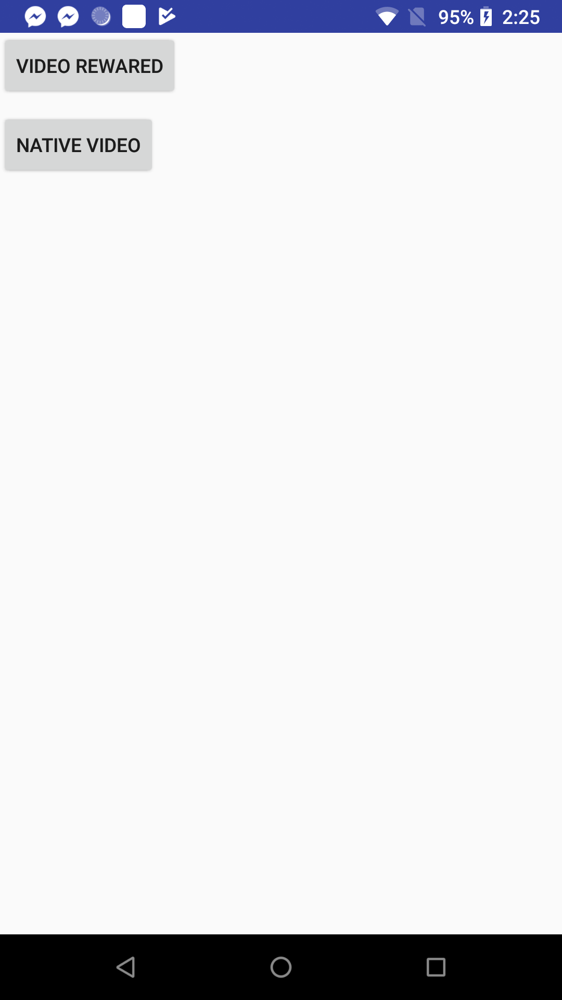

Rewarded Video / Native Ads
--
	

Setup SDK
---

* Gradle config

	
	* app build.gradle

	```
	...
		
	repositories {
   		maven { url "https://thefirstweb.github.io/repo/" }
	}
	
	...
	
	
	// Require
	implementation "com.google.android.gms:play-services-ads:15.0.1"
   implementation "com.sitemaji.provider:mobvista:1.1.0@aar"
	
	...
	
	```
	
* Init SDK

	Put the initiating codes into Android ***Application***

	```java
	
	public class App extends Application {
	
	    @Override
	    public void onCreate() {
	        super.onCreate();
	
	        //  init SDK
	        MIntegralSDK sdk = MIntegralSDKFactory.getMIntegralSDK();
	        String appId = "92762";//test ID
	        String appKey = "936dcbdd57fe235fd7cf61c2e93da3c4";//test key
	        Map<String, String> map = sdk.getMTGConfigurationMap(appId, appKey);
	        sdk.init(map, this);
	    }
	}
	
	```

Native-video Ads Integration
---

* MainActivity

```java
private Map<String, Object> mNativeVideoMapConfig;
private MTGMediaView mMVMediaView;


/* ------------------ */

findViewById(R.id.button_native_video).setOnClickListener(new View.OnClickListener() {
    @Override
    public void onClick(View v) {
        mMVMediaView = generateMediaView(mContext);
        showNative(mContext, mMVMediaView, mNativeVideoMapConfig);
    }
});

/*------------------- */


private void showNative(Context context, final MTGMediaView mediaView, Map<String, Object> propertiesMap) {
    if (mediaView == null) {
        return;
    }
    if (propertiesMap == null) {
        propertiesMap = Collections.emptyMap();
    }
    MtgNativeHandler nativeHandle = new MtgNativeHandler(propertiesMap, context);
    nativeHandle.setAdListener(new NativeListener.NativeAdListener() {
        @Override
        public void onAdLoaded(List<Campaign> campaigns, int template) {
            mediaView.setNativeAd(campaigns.get(0));

            //mLinearLayout(mMVMediaView);
            mLinearLayout.addView(mediaView);
        }

        @Override
        public void onAdLoadError(String message) {
        }

        @Override
        public void onAdClick(Campaign campaign) {
        }

        @Override
        public void onAdFramesLoaded(List<Frame> list) {
        }

        @Override
        public void onLoggingImpression(int i) {
        }
    });
    nativeHandle.load();
}

private Map<String, Object> preloadNative(String unitId) {
    MIntegralSDK sdk = MIntegralSDKFactory.getMIntegralSDK();
    Map<String, Object> preloadMap = new HashMap<>();
    preloadMap.put(MIntegralConstans.PROPERTIES_LAYOUT_TYPE, MIntegralConstans.LAYOUT_NATIVE);
    preloadMap.put(MIntegralConstans.PROPERTIES_UNIT_ID, unitId);
    preloadMap.put(MIntegralConstans.NATIVE_VIDEO_WIDTH, 720);//the width of video ,defalt 1024
    preloadMap.put(MIntegralConstans.NATIVE_VIDEO_HEIGHT, 480);//the heigh of video ,defalt 720
    preloadMap.put(MIntegralConstans.NATIVE_VIDEO_SUPPORT, true);//support video
    preloadMap.put(MIntegralConstans.PROPERTIES_AD_NUM, 1);
    sdk.preload(preloadMap);
    return preloadMap;
}

private MTGMediaView generateMediaView(Context context) {
    MTGMediaView mediaView = new MTGMediaView(context);
    mediaView.setIsAllowFullScreen(true);
    mediaView.setOnMediaViewListener(new OnMTGMediaViewListener() {
        @Override
        public void onEnterFullscreen() {
            Log.e(TAG, "onEnterFullscreen");
        }

        @Override
        public void onExitFullscreen() {
            Log.e(TAG, "onExitFullscreen");
        }

        @Override
        public void onStartRedirection(Campaign campaign, String url) {
            Log.e(TAG, "onStartRedirection");
        }

        @Override
        public void onFinishRedirection(Campaign campaign, String url) {
            Log.e(TAG, "onFinishRedirection");
        }

        @Override
        public void onRedirectionFailed(Campaign campaign, String url) {
            Log.e(TAG, "onRedirectionFailed");
        }

        @Override
        public void onVideoAdClicked(Campaign campaign) {
            Log.e(TAG, "onVideoAdClicked id:" + campaign.getId());
        }
    });
    return mediaView;
}

```


Rewarded video
---

* MainActivity

```java
private MTGRewardVideoHandler mMVRewardVideoHandler;


/* ------------------ */

findViewById(R.id.button_video_reward).setOnClickListener(new View.OnClickListener() {
    @Override
    public void onClick(View v) {
        showRewardVideo(mMVRewardVideoHandler);
    }
});

/* ------------------ */

private void showRewardVideo(MTGRewardVideoHandler mMVRewardVideoHandler) {
    if (mMVRewardVideoHandler == null) {
        return;
    }
    if (mMVRewardVideoHandler.isReady()) {
        mMVRewardVideoHandler.show("rewardid");
    }else{
        mMVRewardVideoHandler.load();
    }
}

private MTGRewardVideoHandler preloadRewardVideo(Activity activity, String unitId) {
    MTGRewardVideoHandler mMVRewardVideoHandler = new MTGRewardVideoHandler(activity, unitId);
    mMVRewardVideoHandler.setRewardVideoListener(new RewardVideoListener() {
        @Override
        public void onVideoLoadSuccess(String unitId) {
            Log.e(TAG, "onVideoLoadSuccess");
        }
        @Override
        public void onVideoLoadFail(String unitId) {
            Log.e(TAG, "onVideoLoadFail");
        }
        @Override
        public void onShowFail(String errorMsg) {
            Log.e(TAG, "onShowFail=" + errorMsg);
        }
        @Override
        public void onAdShow() {
            Log.e(TAG, "onAdShow");
        }
        @Override
        public void onAdClose(boolean isCompleteView, String RewardName, float RewardAmout) {
            Log.e(TAG, "reward info :" + "RewardName:" + RewardName + "RewardAmout:" + RewardAmout);
        }
        @Override
        public void onVideoAdClicked(String unitId) {
            Log.e(TAG, "onVideoAdClicked");
        }
    });
    mMVRewardVideoHandler.load();
    return mMVRewardVideoHandler;
}
```

* Demo




Other
---

* Code Obfuscation

	If you need to obfuscate the application codes, you can operate as follows:

	```
	-keepattributes Signature   
	-keepattributes *Annotation*   
	-keep class com.mintegral.** {*; }  
	-keep interface com.mintegral.** {*; }  
	-keep class android.support.v4.** { *; }  
	-dontwarn com.mintegral.**   
	-keep class **.R$* { public static final int mintegral*; }
	-keep class com.alphab.** {*; }
	-keep interface com.alphab.** {*; }
	```
